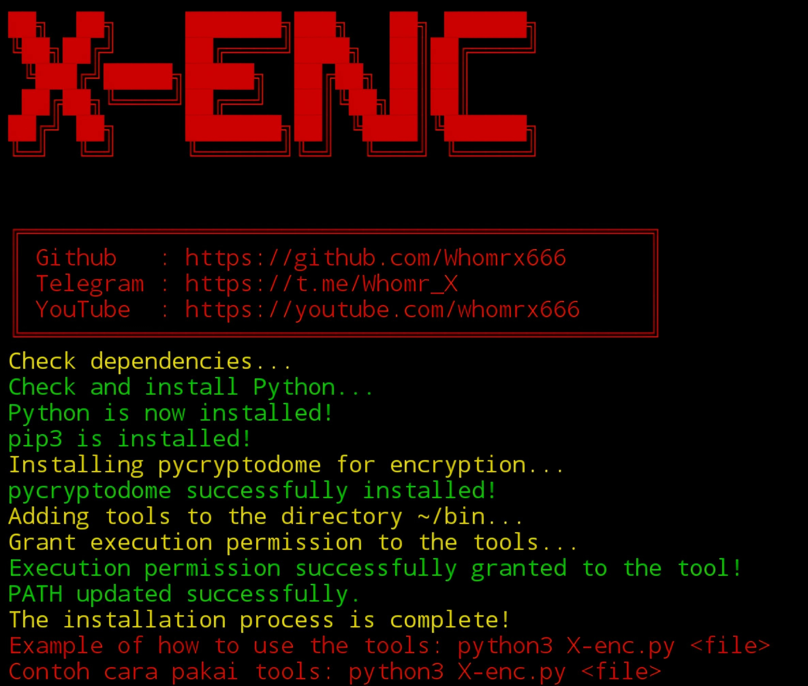

# X-enc


## introduction
**X-enc** is a tool for encoding and obfuscating files in various programming languages using base64 encoding. 
This tool supports multiple languages such as Python, Bash, HTML, JavaScript, and PHP. With this tool, your files 
will be protected and hard to read by unauthorized users.It’s perfect for protecting source code or files that you want to hide the original content or protect from reverse engineering.

## Instalations
```
$ pkg update -y && pkg upgrade -y
$ apt update -y && apt upgrade -y
$ pkg install git
$ pkg install python -y
$ git clone https://github.com/Whomrx666/X-enc.git
$ cd X-enc
$ bash install.sh
$ python3 X-enc.py <file>
```
## Example of running tools if the file is in the sdcard directory!
```
$ python3 X-enc.py /sdcard/name.py
```

## Instructions
- **first**: Install tools according to the instructions above
- **second**: Enter the command as in the example above and go to the location of the file and the file extension, whether python, html, Bash, PHP, javascript
- **third**: The tool will automatically encrypt your files
- **last**: If successful, it will say success, if it fails, it will say failed

# The result


## Features

- **Supports multiple languages**: Python, Bash, HTML, JavaScript, PHP.
- **Base64 Obfuscation**: Obfuscates code using base64 encoding to hide the original logic.
- **Obfuscated output files**: The obfuscated files will be saved with the `_X-enc` suffix added to the file name.
- **UTF-8 Encoding Validation**: Ensures the input files can be encoded with UTF-8.
- **User-friendly**: Displays clear status messages for success or failure.

## Supported Languages

- Python (`.py`)
- Bash (`.sh`)
- HTML (`.html`)
- JavaScript (`.js`)
- PHP (`.php`)

## Notes

- Ensure your files are encoded in UTF-8 for proper obfuscation.
- Obfuscation is intended for protection but is not a substitute for secure coding practices.

## Observation
This is a tool for education only, I am not responsible for any misuse
### Original Author
<a href="https://github.com/Whomrx666"></a>

### <<< If you copy , Then Give me The Credits >>>

## CONNECT WITH ME :

[](https://whomrxhackers.blogspot.com/)
[](https://twitter.com/whomrx666)
[](https://youtube.com/@whomrx666)
[](https://facebook.com/https://www.facebook.com/whomrx.666)
[](https://t.me/@Whomr_X)
[](mailto:whomrx666@gmail.com)
[](https://www.tiktok.com/@whomr.x)

**If you want to donate, click on the button**
<a href="https://saweria.co/whomrx"></a>

### Visitors :

